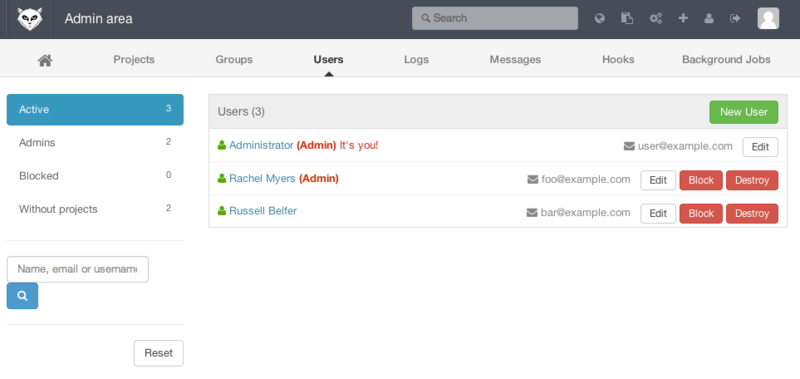

# Git 서버 #

리모트 저장소는 일반적으로 워킹 디렉토리가 없는 _Bare 저장소_ 이다. 이 저장소는 협업용이기 때문에 체크아웃이 필요 없다. 그냥 Git 데이터만 있으면 된다. 다시 말해서 Bare 저장소는 일반 프로젝트에서 `.git` 디렉토리만 있는 저장소다.

## 4.1 프로토콜 ##

- Local
- HTTP
- SSH
- Git

### 로컬 프로토콜 ###

- 팀원들이 전부 한 시스템에 로그인하여 개발
- NFS같은 것으로 파일시스템을 공유하고 있을 때 사용

clone:

	$ git clone /opt/git/project.git
	$ git clone file:///opt/git/project.git

로컬 저장소 추가:

	$ git remote add local_proj /opt/git/project.git

#### 장점 ####

- 단순함
    - 기존에 있던 네트워크나 파일의 권한을 그대로 사용하기 때문에 설정하기 쉽다. 
 - 동료가 작업하는 저장소에서 한 일을 바로 가져오기
    - `git pull /home/john/project` 라는 명령어를 바로 실행시켜서 매우 쉽게 동료의 코드를 가져올 수 있다.

#### 단점 ####

- 다양한 상황에서 접근 어려움
- 속도 느림
    - NFS에 있는 저장소에 Git을 사용하는 것은 보통 같은 서버에 SSH로 접근하는 것보다 느리다.
- 우발적 사고 보호하지 않음.
    - remote 디렉토리 작업 가능

### HTTP 프로토콜 ###
버전 1.6.6이후부터 스마트 HTTP 사용 가능
#### 스마트 HTTP ####
SSH나 Git 프로토콜처럼 통신. 지금은 Git에서 가장 많이 사용하는 프로토콜.

- 익명으로도 사용 가능
- 인증을 거쳐 PUSH 가능

GitHub에서 제공하는 저장소는 Clone할 때나 Push 할 때 같은 URL을 사용한다. (현재 미국 BSW 프로젝트에서도 aws에서 http를 이용)

#### 멍청한 HTTP ####
Git 서버가 스마트 HTTP요청에 응답하지 않으면 차선책으로 멍청한 HTTP 시도. 설정이 **아름다울 정도로** 간단하다.

- HTTP 도큐먼트 루트 밑에 Bare 저장소를 두고 post-update 훅을 설정 (*8.3장* Git Hooks에서 자세히...)

HTTP를 통해서 저장소를 읽을 수 있게 하려면 아래와 같이 한다(Apache server):

	$ cd /var/www/htdocs/
	$ git clone --bare /path/to/git_project gitproject.git
	$ cd gitproject.git
	$ mv hooks/post-update.sample hooks/post-update
	$ chmod a+x hooks/post-update

post-update 훅은 Git에 포함되어 있으며 `git update-server-info`라는 명령어를 실행. HTTP로 Fetch와 Clone 명령이 잘 동작하게 한다. SSH를 통해서 저장소에 Push할 때 실행

clone:

	$ git clone http://example.com/gitproject.git

다른 웹 서버를 사용해도 된다. 단순히 Bare 저장소를 HTTP 문서 루트에 넣으면 된다. Git 데이터는 일반적인 정적 파일처럼 취급(*10장*에서 취급방법...)

HTTP를 통해서 Push하는 것도 가능. 단지 이 방법은 잘 사용하지 않는 WebDAV 환경을 완벽하게 구축해야 한다. 이 책에서도 다루지 않는다. 
`http://www.kernel.org/pub/software/scm/git/docs/howto/setup-git-server-over-http.txt` 참조
 WebDAV 서버를 아무거나 골라 쓸 수 있음.

#### 장점 ####

스마트 HTTP 프로토콜의 장점
- 읽기와 쓰기에 하나의 URL만 사용
- 사용자에게 익숙한 아이디와 비밀번호 방식의 인증
- HTTPS 데이터 암호화, SSL 인증서 사용
- 거의 모든 회사가 트래픽이 방화벽을 통과하도록 허용

#### 단점 ####

- HTTP/S를 사용하도록 설정하는 것이 까다로운 서버가 있음.
- Push할 때 SSH를 사용하는 것 보다 좀 더 복잡하다. HTTP 비밀번호 캐싱 설정에 대한 자세한 사항은 *7.14* Credential 저장소 참조

### SSH 프로토콜 ###

- Git의 대표 프로토콜
- SSH는 읽기/쓰기 접근을 쉽게 할 수 있는 유일한 네트워크 프로토콜
    - HTTP와 Git은 일반적으로 읽기만 가능
- 인증 지원
- 사용, 설치 쉽다.

clone:

	$ git clone ssh://user@server/project.git

scp:

	$ git clone user@server:project.git

계정을 생략하면 Git은 현재 로그인한 사용자의 계정을 사용한다.

#### 장점 ####

- 누가 리모트에서 저장소에 접근하는지 알고 싶다면 SSH를 사용
- 상대적으로 설정하기 쉽다.
- 보안에 안전하다.
- 전송 시 데이터를 가능한 압축하기 때문에 효율적이다.

#### 단점 ####

- 익명으로 접근할 수 없다
    - 오픈소스 프로젝트는 SSH만으로는 부족

### Git 프로토콜 ###

Git에 포함된 데몬을 사용. 포트는 9418
SSH 프로토콜과 비슷한 서비스, 인증 메커니즘이 없다.

저장소에 git-export-daemon-ok 파일을 만들면 Git 프로토콜로 서비스할 수 있지만, 보안은 없다. 
이 저장소는 누구나 Clone할 수 있거나 아무도 Clone할 수 없거나 둘 중의 하나만 선택
이 프로젝트의 URL을 아는 사람은 누구나 Push할 수 있다. **이런 것도 있지만 잘 안 쓴다** 라고 알고 있으면 됨

#### 장점 ####

- Git 프로토콜은 전송속도가 가장 빠르다.

#### 단점 ####

- 인증 메커니즘이 없다.
- 가장 설치하기 어려운 방법
    - 별도의 데몬이 필요하고 프로젝트에 맞게 설정
    - 자원을 아낄 수 있도록 xinetd 같은 것도 설정
    - 방화벽을 통과할 수 있도록 9418 포트도 열어야 한다.

## 4.2 서버에 Git 설치하기 ##

일단 저장소를 Bare 저장소로 만들어야 한다. 

- Bare 저장소는 워킹 디렉토리가 없는 저장소

Bare 저장소 디렉토리는 관례에 따라. git 확장자로 끝난다:

	$ git clone --bare my_project my_project.git
	Cloning into bare repository 'my_project.git'...
	done.

`my_project.git` 디렉토리를 보면 Git 데이터가 들어 있다. 아래와 같이 실행한 것과 비슷:

	$ cp -Rf my_project/.git my_project.git

### 서버에 Bare 저장소 넣기 ###

**ssh설정**:

	$ vi ~/.ssh/config
	Host gitlab.nativebinary.com
	    User ubuntu
	    IdentityFile /PATH/aws-nb-dev-keypair.pem

서버: `gitlab.nativebinary.com`
디렉토리: `~/metalliza/test/`

아래와 같이 Bare 저장소를 복사한다:

	$ scp -r my_project.git gitlab.nativebinary.com:~/metalliza/test/my_project.git

clone:

	$ git clone gitlab.nativebinary.com:~/metalliza/test/my_project.git

이 서버에 SSH로 접근할 수 있는 사용자가 `/opt/git/my_project.git` 디렉토리에 쓰기 권한까지 가지고 있으면 바로 Push할 수 있다. `git init` 명령에 `--shared` 옵션을 추가하면 Git은 자동으로 그룹 쓰기 권한을 추가한다:

	$ ssh gitlab.nativebinary.com
	$ cd ~/metalliza/test/my_project.git
	$ git init --bare --shared

### 초 간단 뚝딱 ###

사람이 많으면 어떤 사용자는 읽기만 가능하게 하고 어떤 사용자는 읽고 쓰기 둘 다 가능하게 하는 것이 좀 까다롭다.

#### SSH 접속 ####

만약 모든 개발자가 SSH로 접속할 수 있는 서버가 있으면 너무 **쉽게** 저장소를 만들 수 있다. 저장소의 권한을 꼼꼼하게 관리해야 하면 그냥 **운영체제의 파일시스템 권한관리**를 이용한다.

- 모두에게 계정을 만들어 주는 방법. 
    - 제일 단순하지만 다소 귀찮은 방법이다.
- 서버마다 git이라는 계정을 하나씩 만드는 방법. 
    - 쓰기 권한이 필요한 사용자의 SSH 공개키를 모두 모아서 git 계정의 `~/.ssh/authorized_keys`파일에 모든 키를 입력한다. 그러면 모두 git 계정으로 그 서버에 접속할 수 있다. 접속하는 데 사용한 SSH 계정과 커밋에 저장되는 사용자는 아무 상관없다.
- LDAP 이용
    - SSH 인증 메커니즘 중 아무거나 하나 이용할 수 있으면 그 서버에 접속이 가능하다.

## 4.3 SSH 공개키 만들기 ##

공개키를 만드는 방법은 모든 운영체제가 비슷하다.:

	$ cd ~/.ssh
	$ ls
	authorized_keys2  id_dsa       known_hosts
	config            id_dsa.pub

`.pub`파일이 공개키이고 다른 파일은 개인키이다.
이 파일이 없거나 `.ssh` 디렉토리도 없으면 `ssh-keygen`이라는 프로그램으로 키를 생성한다.

	$ ssh-keygen
	Generating public/private rsa key pair.
	Enter file in which to save the key (/Users/schacon/.ssh/id_rsa):
	Enter passphrase (empty for no passphrase):
	Enter same passphrase again:
	Your identification has been saved in /Users/schacon/.ssh/id_rsa.
	Your public key has been saved in /Users/schacon/.ssh/id_rsa.pub.
	The key fingerprint is:
	43:c5:5b:5f:b1:f1:50:43:ad:20:a6:92:6a:1f:9a:3a schacon@agadorlaptop.local

- 디렉토리를 입력하고 암호를 두 번 입력.
    - 이때 암호를 비워두면 키를 사용할 때 암호를 묻지 않는다.

`.pub` 파일의 내용을 복사하여 메일을 보내기만 하면 된다.

- 다양한 운영 체제에서 SSH 키를 만드는 방법:
    - http://github.com/guides/providing-your-ssh-key

## 4.4 서버에 설정하기 ##

먼저 `git` 계정을 만들고 사용자 홈 디렉토리에 .ssh 디렉토리를 만든다:

	$ sudo adduser git
	$ su git
	$ cd
	$ mkdir .ssh && chmod 700 .ssh
	$ touch .ssh/authorized_keys && chmod 600 .ssh/authorized_keys

`authorized_keys` 파일에 추가한다:

	$ cat /tmp/id_rsa.john.pub >> ~/.ssh/authorized_keys
	$ cat /tmp/id_rsa.josie.pub >> ~/.ssh/authorized_keys
	$ cat /tmp/id_rsa.jessica.pub >> ~/.ssh/authorized_keys

`--bare` 옵션을 주고 `git init`을 실행해서 워킹 디렉토리가 없는 빈 저장소를 하나 만든다:

	$ cd /opt/git
	$ mkdir project.git
	$ cd project.git
	$ git --bare init

이제 John씨, Josie씨, Jessica씨는 이 저장소를 리모트 저장소로 등록하면 브랜치를 Push할 수 있다. 적어도 한 명은 서버에 접속하여 Bare 저장소를 만들어야 한다. :

	# on Johns computer
	$ cd myproject
	$ git init
	$ git add .
	$ git commit -m 'initial commit'
	$ git remote add origin git@gitserver:/opt/git/project.git
	$ git push origin master

이제 이 프로젝트를 Clone하고 나서 수정하고 Push한다:

	$ git clone git@gitserver:/opt/git/project.git
	$ cd project
	$ vim README
	$ git commit -am 'fix for the README file'
	$ git push origin master

*** SSH Git 서버 설정 완료!!!***

`git-shell`: git 계정을 사용하는 사용자들이 Git 말고 다른 것을 할 수 없도록 제한, 보안 강화
`git` 계정은 Git 저장소에 Push하고 Pull하는 것만 가능

## 4.5 Git 데몬 ##

Git Protocol 데몬 설정. 인증이 없는 Git 저장소를 만드는 방법

**외부 노출된 서버일 경우 보안관리 필요**

상대적으로 쉽다.:

	$ git daemon --reuseaddr --base-path=/opt/git/ /opt/git/
	
서버에서 git daemon 실행. 운영체제별 다름. 책 참조

## 4.6 스마트 HTTP ##

서버로 아파치를 사용:

	$sudo apt-get install apache2 apache2-utils
	$a2enmod cgi alias env rewrite

위 명령으로 mod_cgi, mod_alias, mod_env, mod_rewrite 모듈 명령어를 사용할 수 있다.

아파치 인스턴스 기본설정: 

	$ chgrp -R www-data /opt/git
	
아파치 설정파일 수정:

	SetEnv GIT_PROJECT_ROOT /opt/git
	SetEnv GIT_HTTP_EXPORT_ALL
	ScriptAlias /git/ /usr/lib/gitcore/git-http-backend/
	
GIT_HTTP_EXPORT_ALL을 설정하지 않으면 아무나 접근 가능.

git-http-backend 요청 허용 및 쓰기접근 인증:

	RewriteEngine On
	RewriteCond %{QUERY_STRING} service=git-receive-pack [OR]
	RewriteCond ${REQUEST_URI} /git-receive-pack$
	RewriteRule ^/git/ - [E=AUTHREQUIRED]
	
	<Files "git-http-backend">
		AuthType Basic
		AuthName "Git Access"
		AuthUserFile /opt/git/.htpasswd
		Require valid-user
		Order deny,allow
		Deny from env=AUTHREQUIRED
		Satisfy any
	</Files>
	
. htpasswd 파일에는 접근허가하는 사용자 패스워드 입력:

	$htpasswd -c /opt/git/.htpasswd schacon

위 설정으로 아파치로 SSL을 이용해 사용자 인증하여 통신.

git http-backend와 git을 함께 사용할 수 있으면 아파치 말고도 어떤 서버든 붙일 수 있다.

## 4.7 GitWeb ##

웹에서 저장소를 조회할 수 있는 인터페이스

 
그림 4-1. Git 웹용 UI, GitWeb

즉시 실행 (lighttpd, webrick, **httpd**등 필요:

	$ git instaweb --httpd=webrick
	[2009-02-21 10:02:21] INFO  WEBrick 1.3.1
	[2009-02-21 10:02:21] INFO  ruby 1.8.6 (2008-03-03) [universal-darwin9.0]

1234 포트로 HTTPD 서버를 시작하고 이 페이지를 여는 웹브라우저를 자동으로 실행시킨다.

같은 명령어에 `--stop` 옵션을 추가하여 서버 중지:

	$ git instaweb --httpd=webrick --stop

`apt`나 `yum`으로도 `gitweb`을 설치할 수 있음

수동으로 설치:

	$ git clone git://git.kernel.org/pub/scm/git/git.git
	$ cd git/
	$ make GITWEB_PROJECTROOT="/opt/git" \
	        prefix=/usr gitweb/gitweb.cgi
	$ sudo cp -Rf gitweb /var/www/

VirtualHost 항목을 설정:

	<VirtualHost *:80>
	    ServerName gitserver
	    DocumentRoot /var/www/gitweb
	    <Directory /var/www/gitweb>
	        Options ExecCGI +FollowSymLinks +SymLinksIfOwnerMatch
	        AllowOverride All
	        order allow,deny
	        Allow from all
	        AddHandler cgi-script cgi
	        DirectoryIndex gitweb.cgi
	    </Directory>
	</VirtualHost>

GitWeb은 CGI를 지원하는 웹서버라면 아무거나 사용할 수 있다.

## 4.8 GitLab ##

기능이 많은 만큼 설정 및 유지보수가 복잡

### 설치 ###

- 다운 로드 : https://bitnami.com/stack/gitlab

 
그림 4-2 Bitnami GitLab 가상 머신의 로그인 화면

- 추가 내용 : https://gitlab.com/gitlab-org/gitlab-ce/tree/master

### 관리자 ###

- 기본 사용자 이름 : admin@local.host
- 기본 비밀번호 : 5iveL!fe

그림 4-3 GitLab 메뉴의 Admin area 버튼

#### 사용자 ####

한사람당 하나씩 만든다.
 
그림 4-4 GitLab 사용자의 관리 화면

삭제방법에는 Blocking(이용정지)과 Destroying(영구삭제) 두 가지가 있다.

#### 그룹 ####

권한 묶음

그림 4-5 GitLab 그룹 관리 화면

그룹 권한과 그룹의 프로젝트별 관한이 따로 존재한다.
`Guest`부터 `Owner`까지 지정 가능.

#### 프로젝트 ####

- 쉽게 말해 하나의 Git 저장소.
- 한 명의 **사용자**나 하나의 **그룹**에 속한다.
- 공개 수준 지정 가능
    - Private, Internal, Public

#### 훅 ####

- `프로젝트 훅` 또는 `시스템 훅`
- 이벤트 발생시 json 데이터를 http post로 전달, 자동화 가능

### 기본 사용법 ###

- 툴바의 `+` 아이콘으로 새 프로젝트 생성
    - 네임스페이스, 공개 수준 입력
- 로컬 Git 저장소 연결 (https 또는 ssh 프로토콜)
    -  프로젝트 홈페이지 윗쪽에 저장소 URL

gitlab이라는 이름으로 등록:
    
	$ git remote add gitlab https://server/namespace/project.git
	
로컬 저장소가 없을 경우 빈 프로젝트 클론:

	$ git clone https://server/namespace/project.git

웹 UI를 통해 최근 활동, 파일 커밋 로그등을 확인

### 함께 일하기 ###

Git 저장소의 push 권한을 주는걸로 간단한 협업 가능

- Member에 추가
- push권한 설정
- Merge 요청 통제 가능
    - push 권한이 없으면 fork해서 자신의 저장소에 Push 한 후 Merge 요청한다.
    - Merge 요청과 이슈 설정을 통해 토론 뿐만 아니라 라인단위 대화 가능
    - 요청과 이슈는 사용자에게 할당되거나 마일스톤 과제로 편입

## 4.9 또 다른 선택지, 호스팅 ##

Git 서버를 직접 운영하기 부담스러운 경우 외부 호스팅을 이용할 수 있다.

- 설정이 쉽다.
- 관리비용을 아낄 수 있다.
- 손쉽게 **오픈소스** 커뮤니티 구성 가능

※ Git 서버 호스팅 서비스 리스트
https://git.wiki.kernel.org/index.php/GitHosting

GitHub는 *6장*에서 자세히 설명

## 4.10 요약 ##

서버를 직접 운영하면

- 제어범위가 넓어짐
- 방화벽 등을 운영
- 설정 및 유지보수에 시간 소요

호스팅 사이트를 이용하면

- 설정과 유지보수가 쉬워진다.
- 코드를 외부에 두게 된다
    - 회사나 조직에서 허용 여부 고려

필요에 따라 혼용
