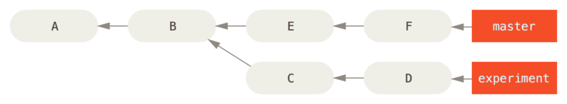

# 7장 Git 도구 #

## 7.1 리비전 조회하기 ##

리비전 하나를 조회할 수도 있고 범위를 주고 여러 개를 조회할 수도 있다. 잘 쓰진 않지만 알아두는게 좋다.

### 리비전 하나 가리키기 ###

### SHA-1 줄여 쓰기 ###

	$ git log
	commit 1c002dd4b536e7479fe34593e72e6c6c1819e53b
	Author: Scott Chacon <schacon@gmail.com>
	Date:   Thu Dec 11 14:58:32 2008 -0800
	
	    added some blame and merge stuff
	
	$ git show 1c002dd4b536e7479fe34593e72e6c6c1819e53b
	$ git show 1c002dd4b536e7479f
	$ git show 1c002d

**--abbrev-commit**
	$ git log --abbrev-commit --pretty=oneline
	ca82a6d changed the version number
	085bb3b removed unnecessary test code
	a11bef0 first commit

### 브랜치로 가리키기 ###

	$ git show ca82a6dff817ec66f44342007202690a93763949
	$ git show topic1

**rev-parse**

	$ git rev-parse topic1
	ca82a6dff817ec66f44342007202690a93763949

### RefLog로 가리키기 ###

	$ git reflog
	734713b HEAD@{0}: commit: fixed refs handling, added gc auto, updated
	d921970 HEAD@{1}: merge phedders/rdocs: Merge made by recursive.
	1c002dd HEAD@{2}: commit: added some blame and merge stuff
	1c36188 HEAD@{3}: rebase -i (squash): updating HEAD
	95df984 HEAD@{4}: commit: # This is a combination of two commits.
	1c36188 HEAD@{5}: rebase -i (squash): updating HEAD
	7e05da5 HEAD@{6}: rebase -i (pick): updating HEAD
	
	$ git show HEAD@{5}
	
	$ git show master@{yesterday}
	
	$ git log -g --oneline
	761d144 HEAD@{0}: commit: redeem coupon reduce duplicated executed code
	345e2a1 HEAD@{1}: commit: me() caching expire time 0 membership, coupon page
	dba40fe HEAD@{2}: commit: rebuilding me()
	4d05d9d HEAD@{3}: commit: refresh me after coupon redeem
	3065c0b HEAD@{4}: commit: couponPage refresh after redeem
	f9e5800 HEAD@{5}: commit: apply more coupons list
	48f9897 HEAD@{6}: commit: change coupon list

reflog: Local only

### 계통 관계로 가리키기 ###

`HEAD^`는 바로 "HEAD의 부모"

	$ git show HEAD^
	commit d921970aadf03b3cf0e71becdaab3147ba71cdef
	Merge: 1c002dd... 35cfb2b...
	Author: Scott Chacon <schacon@gmail.com>
	Date:   Thu Dec 11 15:08:43 2008 -0800
	
	    Merge commit 'phedders/rdocs'

`d921970^2`는 "d921970의 두 번째 부모". 두 번째 부모가 있는 Merge 커밋에만 사용
	$ git show d921970^
	commit 1c002dd4b536e7479fe34593e72e6c6c1819e53b
	Author: Scott Chacon <schacon@gmail.com>
	Date:   Thu Dec 11 14:58:32 2008 -0800
	
	    added some blame and merge stuff
	
	$ git show d921970^2
	commit 35cfb2b795a55793d7cc56a6cc2060b4bb732548
	Author: Paul Hedderly <paul+git@mjr.org>
	Date:   Wed Dec 10 22:22:03 2008 +0000
	
	    Some rdoc changes

`HEAD~`와 `HEAD^`는 똑같이 첫 번째 부모
`HEAD~2`는 "첫 번째 부모의 첫 번째 부모", 즉 "조부모"

`HEAD~3` == `HEAD^^^`

이 두 표현을 같이 사용할 수도 있다.
`HEAD~3^2`를 사용하면 증조부모의 Merge 커밋의 두 번째 부모

### 범위로 커밋 가리키기 ###

#### Double Dot ####

 
그림 6-1. 범위를 설명하는 데 사용할 예제

"master에는 없지만, experiment에는 있는 커밋"

	$ git log master..experiment
	D
	C

반대로 `experiment`에는 없고 `master`에만 있는 커밋

	$ git log experiment..master
	F
	E

리모트 저장소에 Push할 때에도 마찬가지

	$ git log origin/master..HEAD

이 명령은 `origin` 저장소의 `master` 브랜치에는 없고 현재 Checkout중인 브랜치에만 있는 커밋을 보여준다. Checkout한 브랜치가 `origin/master`라면 `git log origin/master..HEAD`가 보여주는 커밋이 Push하면 서버에 전송될 커밋이다. 그리고 한쪽의 레퍼런스를 생략하면 Git은 HEAD라고 가정한다. `git log origin/master..`는 `git log origin/master..HEAD`와 같다.

#### 세 개 이상의 레퍼런스 ####

`^`과 `--not` 옵션 뒤에 브랜치 이름을 넣으면 그 브랜치에 없는 커밋을 찾아준다. 다음 명령어는 모두 같은 명령이다:

	$ git log refA..refB
	$ git log ^refA refB
	$ git log refB --not refA

`refA`나 `refB`에는 있지만 `refC`에는 없는 커밋

	$ git log refA refB ^refC
	$ git log refA refB --not refC

이 조건을 잘 응용하면 작업 중인 브랜치와 다른 브랜치를 매우 상세하게 비교할 수 있다.

#### Triple Dot ####

두 레퍼런스 사이에서 공통으로 가지는 것을 제외하고 서로 다른 커밋만 보여준다. 만약 `master`와 `experiment`의 공통부분은 빼고 다른 커밋만 보고 싶으면 아래와 같이 하면 된다:

	$ git log master...experiment
	F
	E
	D
	C

**--left-right**

	$ git log --left-right master...experiment
	< F
	< E
	> D
	> C

## 7.2 대화형 명령어 ##

	$ git add -i
	           staged     unstaged path
	  1:    unchanged        +0/-1 TODO
	  2:    unchanged        +1/-1 index.html
	  3:    unchanged        +5/-1 lib/simplegit.rb
	
	*** Commands ***
	  1: status     2: update      3: revert     4: add untracked
	  5: patch      6: diff        7: quit       8: help
	What now>

## 7.3 Stashing ##

### 하던 일을 Stash하기 ###

	$ git status
	# On branch master
	# Changes to be committed:
	#   (use "git reset HEAD <file>..." to unstage)
	#
	#      modified:   index.html
	#
	# Changes not staged for commit:
	#   (use "git add <file>..." to update what will be committed)
	#
	#      modified:   lib/simplegit.rb
	#

`git stash`
	$ git stash
	Saved working directory and index state \
	  "WIP on master: 049d078 added the index file"
	HEAD is now at 049d078 added the index file
	(To restore them type "git stash apply")
	
	$ git status
	# On branch master
	nothing to commit, working directory clean

`git stash list`
	$ git stash list
	stash@{0}: WIP on master: 049d078 added the index file
	stash@{1}: WIP on master: c264051 Revert "added file_size"
	stash@{2}: WIP on master: 21d80a5 added number to log

`git stash apply`
	$ git stash apply
	# On branch master
	# Changes not staged for commit:
	#   (use "git add <file>..." to update what will be committed)
	#
	#      modified:   index.html
	#      modified:   lib/simplegit.rb
	#

`--index` Staged 상태까지 복원
	$ git stash apply --index
	# On branch master
	# Changes to be committed:
	#   (use "git reset HEAD <file>..." to unstage)
	#
	#      modified:   index.html
	#
	# Changes not staged for commit:
	#   (use "git add <file>..." to update what will be committed)
	#
	#      modified:   lib/simplegit.rb
	#

`git stash drop` Stash를 제거
	$ git stash list
	stash@{0}: WIP on master: 049d078 added the index file
	stash@{1}: WIP on master: c264051 Revert "added file_size"
	stash@{2}: WIP on master: 21d80a5 added number to log
	$ git stash drop stash@{0}
	Dropped stash@{0} (364e91f3f268f0900bc3ee613f9f733e82aaed43)

`git stash pop` Stash를 적용하고 나서 바로 스택에서 제거

### Stash 되돌리기 ###

Stash를 이용해서 패치를 만들고 그것을 거꾸로 적용

	$ git stash show -p stash@{0} | git apply -R

Stash를 명시하지 않으면 Git은 가장 최근의 Stash를 사용한다:

	$ git stash show -p | git apply -R

`stash-unapply`라는 alias를 만들고 편리하게 할 수도 있다:

	$ git config --global alias.stash-unapply '!git stash show -p | git apply -R'
	$ git stash apply
	$ #... work work work
	$ git stash-unapply

### Stash를 적용한 브랜치 만들기 ###

`git stash branch` 명령을 실행하면 Stash할 당시의 커밋을 Checkout한 후 새로운 브랜치를 만들고 여기에 적용한다. 이 모든 것이 성공하면 Stash를 삭제한다:

	$ git stash branch testchanges
	Switched to a new branch "testchanges"
	# On branch testchanges
	# Changes to be committed:
	#   (use "git reset HEAD <file>..." to unstage)
	#
	#      modified:   index.html
	#
	# Changes not staged for commit:
	#   (use "git add <file>..." to update what will be committed)
	#
	#      modified:   lib/simplegit.rb
	#
	Dropped refs/stash@{0} (f0dfc4d5dc332d1cee34a634182e168c4efc3359)

## 7.4 내 작업에 서명하기 ##
GPG를 이횽하여 서명하여 확인된 사람에게만 커밋 받기

### GPG 소개 ###
KEY 확인
	$ gpg --list-keys
	/Users/schacon/.gnupg/pubring.gpg
	----
	pub   2048R/0A46826A 2014-06-04
	uid                  Scott Chacon (Git signing key) <schacon@gmai.com>
	sub   2048R/874529A9 2014-06-04

KEY 생성
`gpg --gen-key`

git 설정
`git config --global user.signingkey 0A46826A`

### 태그 서명하기 ###
**-s option** tag시 암호 입력함
	$ git tag -s v1.5 -m 'my sigined 1.5 tag'

	You need a passphrase to un;ock the secret key for
	user: "BEN Straub <ben@straub.cc>"
	2048-bit RSA key, ID 800430EB, created 2014-05-04
	
	$ git show v1.5
	tag v1.5
	Tagger: Ben Straub <ben@straub.cc>
	Date:   Sat May 3 20:29:41 2014 -0700
	
	my signed 1.5. tag
	-----BEGIN PGP SIGNATURE-----
	Version: GnuPG v1
	
	iQEcBAABAgAGBQJTZbQlAAoJEF0+sviABDDrZbQH/09PfE51KPVPlanr6q1v4/Ut
	LQxfojUWiLQdg2ESJItkcuweYg+kc3HCyFejeDIBw9dpXt00rY26p05qrpnG+85b
	hM1/PswpPLuBSr+oCIDj5GMC2r2iEKsfv2fJbNW8iWAXVLoWZRF8B0MfqX/YTMbm
	ecorc4iXzQu7tupRihslbNkfvfciMnSDeSvzCpWAHl7h8Wj6hhqePmLm9lAYqnKp
	8S5B/1SSQuEAjRZgI4IexpZoeKGVDptPHxLLS38fozsyi0QyDyzEgJxcJQVMXxVi
	RUysgqjcpT8+iQM1PblGfHR4XAhuOqN5Fx06PSaFZhqvWFezJ28/CLyX5q+oIVk=
	=EFTF
	-----END PGP SIGNATURE-----
	
	commit ca82a6dff817ec66f44342007202690a937663949
	Author: Scott Chacon <chacon@gee-mail.com>
	Date:   Mon Mar 17 21:52:11 2008 -0700
	
	   changed the version number

### 태그 확인하기 ###
**-v option**
	$ git tag -v v1.4.2.1
	object 883653babd8ee7ea23e6a5c392bb739348b1eb61
	type commit
	tag v1.4.2.1
	tagger Junio C Hamano <junkio@cox.net> 1158138501 -0700
	
	GIT 1.4.2.1
	
	Minor fixes since 1.4.2, including git-mv and git-http with alternates.
	gpg: Signature made Wed Sep 13 02:08:25 2006 PDT using DSA key ID F3119B9A
	gpg: Good signature from "Junio C Hamano <junkio@cox.net>"
	gpg:                 aka "[jpeg image of size 1513]"
	Primary key fingerprint: 3565 2A26 2040 E066 C9A7  4A7D C0C6 D9A4 F311 9B9A

### 커밋에 서명하기 ###
**-s option** 커밋시 암호 입력함
	$ git commit -a -S -m 'signed commit'

    You need a passphrase to unlock the secret key for
    user: "Scott Chacon (Git signing key) <schacon@gmail.com>"
    2048-bit RSA key, ID 0A46826A, created 2014-06-04
    
    [master 5c3386c] signed commit
     4 files changed, 4 insertions(+), 24 deletions(-)
     rewrite Rakefile (100%)
     create mode 100644 lib/git.rb

커밋 서명 확인 `--show-signature` 옵션
    $ git log --show-signature -1
    commit 5c3386cf54bba0a33a32da706aa52bc0155503c2
    gpg: Signature made Wed Jun  4 19:49:17 2014 PDT using RSA key ID 0A46826A
    gpg: Good signature from "Scott Chacon (Git signing key) <schacon@gmail.com>"
    Author: Scott Chacon <schacon@gmail.com>
    Date:   Wed Jun 4 19:49:17 2014 -0700
    
        signed commit

Merge
    $ git merge --verify-signatures non-verify
    fatal: Commit ab06180 does not have a GPG signature.
    
    $ git merge --verify-signatures signed-branch
    Commit 13ad65e has a good GPG signature by Scott Chacon (Git signing key) <schacon@gmail.com>
    Updating 5c3386c..13ad65e
    Fast-forward
     README | 2 ++
     1 file changed, 2 insertions(+)

**-s option**
    $ git merge --verify-signatures -S  signed-branch
    Commit 13ad65e has a good GPG signature by Scott Chacon (Git signing key) <schacon@gmail.com>
    
    You need a passphrase to unlock the secret key for
    user: "Scott Chacon (Git signing key) <schacon@gmail.com>"
    2048-bit RSA key, ID 0A46826A, created 2014-06-04
    
    Merge made by the 'recursive' strategy.
     README | 2 ++
     1 file changed, 2 insertions(+)

### 모두가 서명하게 하려면 ###
팀의 모든 사람이 서명 기능을 이해해야 함

## 7.5 검색 ##
### Git Grep ###
    $ git grep -n gmtime_r
    compat/gmtime.c:3:#undef gmtime_r
    compat/gmtime.c:8:      return git_gmtime_r(timep, &result);
    compat/gmtime.c:11:struct tm *git_gmtime_r(const time_t *timep, struct tm *result)
    compat/gmtime.c:16:     ret = gmtime_r(timep, result);
    compat/mingw.c:606:struct tm *gmtime_r(const time_t *timep, struct tm *result)
    compat/mingw.h:162:struct tm *gmtime_r(const time_t *timep, struct tm *result);
    date.c:429:             if (gmtime_r(&now, &now_tm))
    date.c:492:             if (gmtime_r(&time, tm)) {
    git-compat-util.h:721:struct tm *git_gmtime_r(const time_t *, struct tm *);
    git-compat-util.h:723:#define gmtime_r git_gmtime_r

파일별 카운트
    $ git grep --count gmtime_r
    compat/gmtime.c:4
    compat/mingw.c:1
    compat/mingw.h:1
    date.c:2
    git-compat-util.h:2

함수, 메서드 `-p` 옵션
    $ git grep -p gmtime_r *.c
    date.c=static int match_multi_number(unsigned long num, char c, const char *date, char *end, struct tm *tm)
    date.c:         if (gmtime_r(&now, &now_tm))
    date.c=static int match_digit(const char *date, struct tm *tm, int *offset, int *tm_gmt)
    date.c:         if (gmtime_r(&time, tm)) {

`--and` `--break` `--heading` 옵션

### Git 로그 검색 ###
-S**KEYWORK**
    $ git log -SZLIB_BUF_MAX --oneline
    e01503b zlib: allow feeding more than 4GB in one go
    ef49a7a zlib: zlib can only process 4GB at a time

#### 라인 로그 검색 ####
-L Option 라인 히스토리 검색 가능
    $ git log -L :git_deflate_bound:zlib.c
    commit ef49a7a0126d64359c974b4b3b71d7ad42ee3bca
    Author: Junio C Hamano <gitster@pobox.com>
    Date:   Fri Jun 10 11:52:15 2011 -0700
    
        zlib: zlib can only process 4GB at a time
    
    diff --git a/zlib.c b/zlib.c
    --- a/zlib.c
    +++ b/zlib.c
    @@ -85,5 +130,5 @@
    -unsigned long git_deflate_bound(z_streamp strm, unsigned long size)
    +unsigned long git_deflate_bound(git_zstream *strm, unsigned long size)
     {
    -       return deflateBound(strm, size);
    +       return deflateBound(&strm->z, size);
     }

    commit 225a6f1068f71723a910e8565db4e252b3ca21fa
    Author: Junio C Hamano <gitster@pobox.com>
    Date:   Fri Jun 10 11:18:17 2011 -0700
    
        zlib: wrap deflateBound() too
    
    diff --git a/zlib.c b/zlib.c
    --- a/zlib.c
    +++ b/zlib.c
    @@ -81,0 +85,5 @@
    +unsigned long git_deflate_bound(z_streamp strm, unsigned long size)
    +{
    +       return deflateBound(strm, size);
    +}

`git log -L '/unsigned long git_deflate_bound/',/^}/:zlib.c`